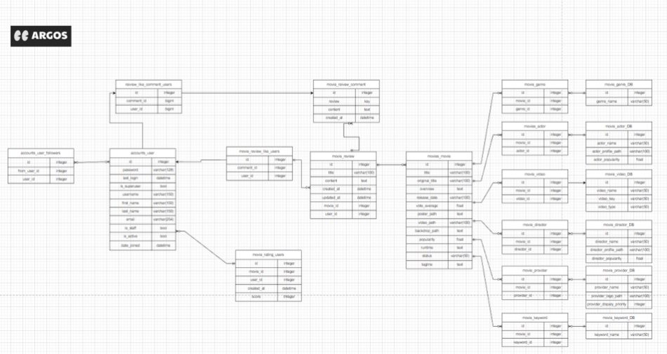
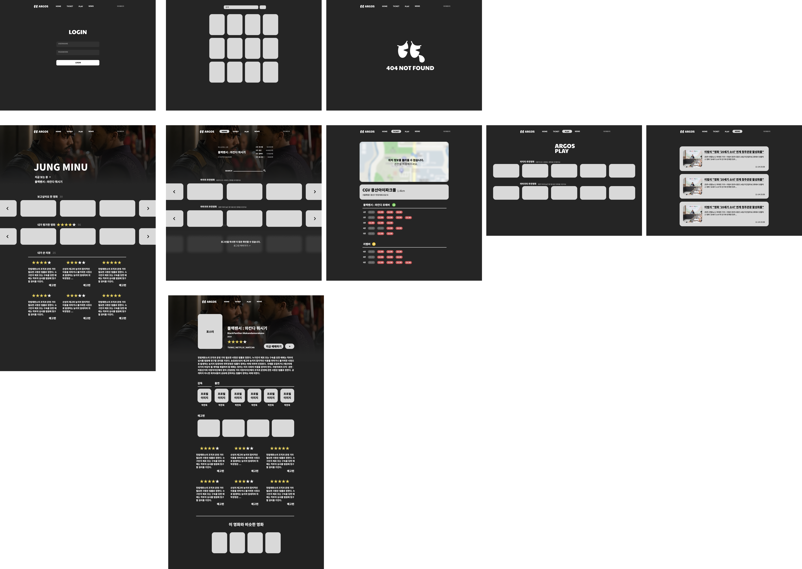
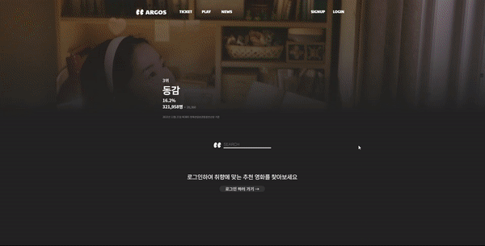
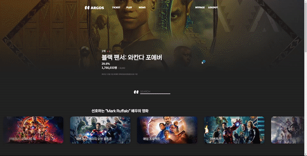
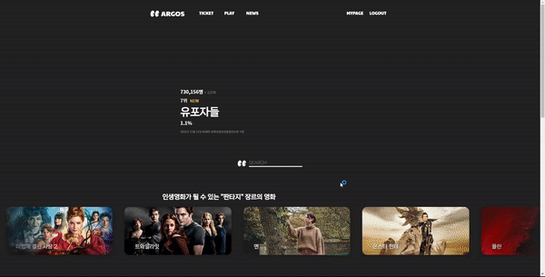

<center><h1>ARGOS</h1></center> 

<center><strong>"영화를 찾는 눈"<strong></center> 

<center>SSAFY 8th Final Team Project</center> 

<br>

>ARGOS는 그리스 로마 신화에 등장하는 100개의 눈이 달린 감시자입니다.
>
>우리의 아르고스는 사용자에게 알맞는 영화를 정확히 찾아내는 눈을 가진 멋진 친구입니다.


---


## 📚 목차

1. [개요](##🌟-개요)

2. [팀](##🧑🏻‍🤝‍🧑🏻-팀)
   
3. [서비스 소개](##📽️-서비스-소개)
  
    1. [서비스 기획 목표](###서비스-기획-목표)
   
    2. [ERD](##ERD)
   
    3. [WireFrame](##WireFrame)

    4. [영화 추천 알고리즘](##영화-추천-알고리즘)

    5. [구현 기능](##구현-기능)
   
4. [설치 및 실행](##🚀-설치-및-실행)
   
5. [오픈소스 출처](##📃-오픈소스-출처)

---

## 🌟 개요

### 프로젝트 기간

2022.11.16 ~ 2022.11.24 (8일)

### 버전

    

### 기술 스택 👨‍💻 

- #### Language
  
  
  

- #### Frameworks
  
  


- #### Library
  
  
  
  
  
  
  
  
  
  


- #### Editor

  


- #### Version Control

  
  
- #### Publishing

  Comming soon...

## 🧑🏻‍🤝‍🧑🏻 팀

|       |  Github  |  역할  |
|:------------:|:------------:|:------------:|
| **정민우** (조장)  |  [minu-j](https://github.com/minu-j/)  |  총괄, Frontend  |
| **김성훈** |  [kimseonghun96](https://github.com/kimseonghun96/)  |  Backend  |

---

## 📽️ 서비스 소개
  
### 서비스 기획 목표

**ARGOS**는 사용자의 별점 평가 척도에 기반하여, 유저가 선호하는 영화의 장르, 배우, 감독, 키워드 별 추천 영화를 유저에게 맞춤 제공하는 서비스입니다.

맞춤 영화 추천 외에도

- 영화 리뷰를 기반으로 한 유저 커뮤니티

- 영화티켓 예매, 무료 영화 감상

- 영화 관련 뉴스 피드 서비스 등...

다양한 부가 서비스를 한 웹사이트에서 제공하여 통합된 사용자 경험을 제공합니다.

ARGOS의 웹사이트 디자인은 Figma Wireframe 툴을 이용하여 철저하게 계획되며, 이미지, 버튼, 카드로 요소를 구분하여 사이트 전체적으로 통일된 동작을 수행할 수 있도록 짜임새있는 UI를 가집니다.


### ERD



ARGOS의 데이터베이스 모델링은 크게 유저와 영화 정보로 구분됩니다.

- 유저는 영화와 score 정보를 가진 N:M 관계로 연결되며, 각 유저와도 팔로잉/팔로워 관계를 위해 N:M 관계로 연결됩니다.

- 영화는 각 장르, 배우, 감독, 키워드, 예고편 영상 주소, 공급사(OTT서비스)의 6가지 요소와 N:M 관계를 가집니다.

### WireFrame




ARGOS는 미리 UI/UX를 정교하게 설계하여 일치된 디자인 요소를 통해 통일감있고 잘 짜여진 사용자 경험을 제공합니다.


### 영화 추천 알고리즘

- ARGOS의 모든 영화평가는 1점에서 5점 사이의 척도를 가진 별점으로 평가됩니다. 

- 유저는 영화를 1점에서 5점로 영화를 평가 하고, ARGOS는 4점 이상을 받은 영화를 유저가 만족하여 본 영화로 판단합니다.

- ARGOS의 데이터베이스에는 모든 영화마다 장르, 출연 배우, 감독, 키워드 정보가 N:M관계로 연결되어 저장되어있습니다.

- 모든 추천 알고리즘은 Django의 Views.py 내에서 작동됩니다. 

- 사용자의 영화 추천을 GET요청받으면, 사용자의 pk값을 통해 사용자가 그동안 매겼던 별점 정보를 탐색하며 사용자가 4점 이상 평가한 영화들을 수집합니다.
  
  ```python
  def get_user_recommend(request, user_pk):
    ratings = get_list_or_404(Rating, user_id=user_pk)
    serializer = RatingListSerializers(ratings, many=True)

    # 반환할 객체
    response_data = { 'data': [] }

    # 사용자의 영화 취향을 계산하는 defaultdict 딕셔너리
    recommend_data = {
        ### 4점 이상 준 영화와 매칭되는 특징을 정리
        # 각 영화를 순회하면서 별점이 높은 특징을 딕셔너리로 만들기
        'like_genre': defaultdict(int), # 좋아하는 장르
        'like_actor': defaultdict(int), # 좋아하는 배우
        'like_director': defaultdict(int), # 좋아하는 감독
        'like_keyword': defaultdict(int) # 좋아하는 키워드    
    }

    for rating in serializer.data:

      # 만약 영화의 점수가 4점 이상이라면?
      if rating['score'] >= 4:
          for genre in rating['movie']['genres']:
              recommend_data['like_genre'][genre['id']] += 1 # 해당 장르 +1점

          for actor in rating['movie']['actors']:
              recommend_data['like_actor'][actor['id']] += 1 # 해당 배우 +1점

          for director in rating['movie']['directors']:
              recommend_data['like_director'][director['id']] += 1 # 해당 감독 +1점

          for keyword in rating['movie']['keywords']:
              recommend_data['like_keyword'][keyword['id']] += 1 # 해당 키워드 +1점
  ```

- 이렇게 모인 사용자 취향의 영화 정보를 바탕으로, 해당 속성의 상위값 4개를 추출합니다. 예를들어 사용자가 평가한 영화 중 '공포'장르의 영화가 다른 장르보다 상위 4번째 안에 속한다면, 장르 리스트에 '공포' 장르를 추가합니다.
  
  ```python
      # 각 항목별로 가장 선호하는 값 4개중에 랜덤으로 2개 뽑기
    genre_list = [] # 장르
    for key, value in sorted(recommend_data['like_genre'].items(), key=lambda x:x[1], reverse=True)[:4]: # 선호하는 4개 값
        genre_list.append(key)

    ...
  ```
- 이렇게 뽑힌 상위 장르들 중에 랜덤으로 2개를 뽑습니다. 이유는 사용자의 평가 정보가 제한적일 경우, 추천영화 목록에 띄우는 영화가 매번 동일해지는 것을 방지하기 위해서입니다.

  ```python
    ...

    if len(genre_list) > 2: 
        genre_list = random.sample(genre_list, 1) # 랜덤으로 2개 뽑기
    else: # 선택한 장르가 2개 미만일 경우도 있으므로, 오류 방지로 1개만 뽑도록 예외처리
        genre_list = random.sample(genre_list, 1)

    ...

  ```

- 랜덤으로 뽑힌 두개의 장르 값을 바탕으로, 해당 장르에 맞는 영화를 랜덤으로 가져옵니다. 장르의 범위가 넓다보니, 사용자의 취향과 다소 벗어나는 영화가 나올 수 있다는 것을 감안하여 영화 데이터베이스의 수집 조건을 강하게 제한했습니다. 정보 수집시 다소 정보가 부족한 영화는 인지도가 부족한 영화로 판단하여 수집을 제한했습니다.

  ``` python
    ...

    for genre_id in genre_list:
        genre = get_object_or_404(Genre, pk=genre_id) # 해당 id에 맞는 영화 가져오기
        serializer = GenreMovieSerializer(genre)
        select_len = 10 # 10개 영화를 기본으로 뽑는데, 영화가 10개가 안되면 길이에 맞게 선정
        if len(serializer.data["movie_set"]) < 10:
            select_len = len(serializer.data["movie_set"])

        # 조건에 맞는 영화가 5개 이상일때만 추천 리스트 생성하기(사이트 디자인 통일감을 위함)
        if len(serializer.data["movie_set"]) >= 5:
            genre_recommend = {
                'prefix': random.choice(prefix),
                'category': '장르',
                'name': serializer.data["name"],
                'movies': random.sample(serializer.data["movie_set"], select_len)
            }
            
            response_data['data'].append(genre_recommend)

    ...

  ```
- 이러한 절차를 장르, 배우, 감독, 키워드 네 가지 속성에 적용하여 네 번 반복합니다. 마지막으로 동일한 속성들이 모이는 것을 방지하기 위해 리스트의 순서를 무작위로 섞은 후 JSON형태로 반환합니다.

  ``` python
  ...

    # 랜덤으로 표시하도록 데이터 섞기
    random.shuffle(response_data['data'])

    # JSON 반환
    return JsonResponse(response_data)

  ```

❌❌❌❌-> 사용자의 평가목록과 알고리즘 출력결과 이미지❌❌❌❌

### 구현 기능

> ✔️ : 구현 성공
> 
> ❔ : 아쉬운 점
>
> ❌ : 구현 실패

- #### ✔️  ARGOS의 디자인 철학

  - ✔️  모든 컴포넌트에서 동일한 요소에 동일한 컬러를 사용하여 디자인 일치감을 만들어줍니다.

  - ✔️  모든 버튼 요소들은 가로로 길쭉한 타원형을 갖고 있으며, 마우스오버시 흰색 테두리가 생성되어 다른 링크로 연결이 될 것을 암시합니다.

  - ✔️  모든 카드 요소들은 20px의 모서리 곡선값을 가진 직사각형으로 이루어져있으며, 동일한 그림자를 갖고있습니다. 마우스오버시 동일한 비율로 스케일이 커지며 다른 링크로 연결이 될 것을 암시합니다.

  - ✔️  모든 모달은 반투명의 배경을 갖고 있으며, 정보가 넘칠 경우 내부에 스크롤박스를 두어 배경과 모달이 분리되어 작동됩니다.

  - ✔️  페이지 내에서 동영상 재생시 배경이 어두워지며 동영상에만 집중할 수 있도록 합니다.

  - ✔️  영화에 대한 모든 평가는 별점으로 매겨집니다. 1점부터 5점까지 채워지는 별을 시각적으로 보여줍니다.

  - ✔️  내가 작성한 댓글, 코멘트와 상대방이 작성한 댓글, 코멘트는 완전히 시각적으로 구분됩니다. 수정, 삭제시에도 다른 링크로 연결되지 않고 그 즉시 직관적으로 작동됩니다.

  - ✔️  '추천영화', '영화 별점 매기기', '뉴스' 페이지는 무한 스크롤 기능을 제공하며, 로딩중이라는 것을 알 수 있도록 로더가 표시됩니다. 로더는 로딩되는 콘텐츠의 모양과 완전히 동일합니다.

- #### ❔ 유저 인증

  - ✔️  회원가입 / 로그인

  - ✔️  회원가입시, 사용자의 입력값에 따라 장고 서버와 실시간으로 통신하여, 해당 username과 password 입력값이 유효한지 판단합니다.

    - username의 value값이 데이터베이스의 username과 중복되는지 여부를 검증합니다.
    - password의 입력이 유효한지 검증하여 실시간 메시지를 출력합니다. 검증 요소는 Django Auth Framework의 검증 요소를 기준으로 합니다.

      1. password와 username의 유사도 판단
   
          ```python
          if SequenceMatcher(None, username, password1).ratio() < 0.7:
              response_data['similarity'] = 'pass'
          ```
      2. password가 8글자 이상인지 확인

          ```python
          if len(password1) >= 8:
              response_data['min_length'] = 'pass'
          ```

      3. password가 일반적인 값인지 확인(2000개의 장고 기본 common password 목록 확인)

          ```python
          if password1 not in common_password:
              response_data['common'] = 'pass'
          ```

      4. password에 영문, 숫자, 특수문자가 모두 포함되어있는지 확인

          ```python
          if any(sym in password1 for sym in '!@#$%^&*()~<>,.[]{}'):
              if any(sym in password1 for sym in 'abcdefghijklmnopqrstuvwxyz'):
                  if any(sym in password1 for sym in '123456789'):
                      response_data['symbols'] = 'pass'
          ```


  - ✔️  로그인/비로그인 상태 구분하여 출력 컨텐츠를 제한합니다. 메인화면에서 개인 추천 영화목록은 로그인을 하기 전까지 출력되지 않습니다.

  - ✔️  로그아웃

  - ❔ 유저 인증에 따른 REST API 요청 제한에 시간을 들이지 못해 view 기능별 유저의 인증정보에 따른 제한이 철저하지 못합니다.

- #### ✔️ 영화 검색

  - ✔️  TMDB API 활용하여 키워드 검색에 따른 영화 리스트 출력

  - ❔ 데이터베이스 내에 있는 영화데이터와, API로 검색 요청한 영화데이터를 동일하게 취급할 수 없어서 검색한 영화에는 별점과 리뷰를 주지 못합니다. 검색된 영화가 영화 데이터베이스에 없다면, 데이터베이스 목록에 추가한다면 개선될 수 있습니다.

  - ✔️  입력에 따른 자동검색 기능을 구현하되, API의 과도한 요청을 제한하기 위해 1초에 한번씩만 검색이 되게 제작했습니다.

- #### ✔️ 맞춤형 영화 추천

  - 영화 추천 알고리즘 구현 

- #### ✔️ 개인 영화취향 분석(마이페이지 내)

  - ✔️ 맞춤형 영화 추천 기능과 동일하게 4점 이상의 영화를 기준으로, 사용자가 높게 평가한 영화의 목록을 추출하고, 해당 목록의 정보를 분석합니다.

  - ✔️ 사용자가 재밌게 본 영화의 키워드를 defultdict로 카운트하여 WordCloud 형태로 데이터를 시각화합니다.

  - ✔️ 사용자가 재밌게 본 영화에 출연한 감독, 배우, 장르의 데이터를 분석하여 높은 비중을 차지하는 데이터 상위 3개를 출력합니다.


- #### ✔️ 영화 디테일 페이지

  - ✔️ 영화의 디테일 페이지에 접속하면 배우, 감독 등 영화의 정보와 유저가 해당 영화에 준 별점, 리뷰와 코멘트를 볼 수 있습니다.
 
  - ✔️ 해당 영화의 예고편을 디테일페이지 내부에서 바로 볼 수 있습니다.

  - ✔️ 해당 영화의 장르, 감독의 다른 연출작, 배우의 다른 출연작을 모달로 확인할 수 있습니다.

  - ✔️ 해당 영화를 볼 수 있는 OTT서비스를 출력하고, 클릭하면 해당 사이트로 이동합니다.

- #### ✔️ 커뮤니티 (CRUD & Follow)

  - ✔️ 영화별 리뷰 작성, 조회, 수정, 삭제를 구현했으며, 해당 영화의 디테일 페이지 최하단에 카드 형태로 별점과 함께 출력됩니다.

  - ✔️ 리뷰별 코멘트 작성, 조회, 삭제를 구현했으며, 해당 리뷰 카드 하단에 채팅 형태로 출력됩니다. 내가 쓴 코멘트는 따로 우측 정렬되어 파란색 배경의 메시지로 표시됩니다.

  - ✔️ 유저간 팔로우 기능과 팔로잉/팔로워 목록을 마이페이지에 표시합니다.

- #### ✔️ 주변 영화관 시간표

  - ✔️ 사용자의 현재 위치정보를 요청하여 위도/경도 값을 파악합니다.
  
  - ✔️ 카카오 API를 이용하여 사용자의 현재 위치 주변에 있는 영화관을 검색하여 배열에 저장합니다.

  - ❔ 사용자 주변에 없는 영화관을 선택하거나, CGV, 메가박스, 롯데시네마 3사 외 다른 영화관을 선택하지 못합니다.

  - ✔️ 영화관을 선택하면 오늘 날짜의 상영시간표를 출력합니다. 네이버 상영시간표 검색결과를 웹크롤링합니다.

  - ❔ 오늘날짜 외 다른 날짜의 시간표는 조회하지 못합니다.

- #### ✔️ 무료 영화관

  - ✔️ 유튜브에 여러 채널에 분산되어 업로드되어있는 고전/독립영화를 한 페이지에 모아볼 수 있도록 출력합니다. 해당 데이터는 관리자가 선정합니다.

- #### ✔️ 영화 기사를 모아보기

  - ✔️ 영화 기사를 웹크롤링하여 카드 형태로 표시합니다. 클릭하면 해당 기사 페이지로 이동합니다.

- #### ✔️ 404 Page

  - ✔️ 데이터베이스의 없는 영화 디테일 페이지나, 존재하지 않는 주소로 이동을 시도하면 404페이지를 출력합니다.


---

## 🚀 설치 및 실행

1. Git Clone

```shell
$ git clone https://github.com/minu-j/Argos.git
```

2. Run Back-server
```shell
 ~/.../Argos/

$ cd final-pjt-back

$ python -m venv venv
$ source venv/Scripts/activate

$ python manage.py makemigrations
$ python manage.py migrate

$ python manage.py loaddata db_1.json
$ python manage.py loaddata db_2.json
$ python manage.py loaddata db_3.json

$ python manage.py runserver
```

3. Run Front-Server
```shell
 ~/.../Argos/

$ cd final-pjt-front/

$ npm install

$ npm run serve
```

4. Done!

---

## 📃 오픈소스 출처

#### API

  [TMDB]() - 영화 정보 검색

  [KOBIS]() - KOFIC 영화관 입장권 통합 전산망

  [KakaoMap]() - 카카오맵

#### etc...

[flaticon](https://www.flaticon.com/) - 아이콘


---

|     | 기능                    | 기능설명                                                                                          |
| --- | --------------------- | --------------------------------------------------------------------------------------------- |
| 1   | 회원 가입                 | 토큰을 통한 유저 회원 가입, 회원 가입 시 자동 로그인, 첫 로그인 시바로 영화 추천을 위한 영화 평가 페이지로 이동                            |
| 2   | 로그인                   | 토큰을 통한 인증 로그인 기능 구현                                                                           |
| 3   | 비 로그인 시               | 추천 영화 페이지 가리기 구현                                                                              |
| 4   | 로그아웃                  | isLogin을 이용해 토큰을 null 값으로 만듬                                                                  |
| 5   | 영화 검색 기능              | 검색하고 싶은 영화를 검색하면 그영화의 소개와 더 많은 정보를 알 수있는 링크 연결                                                |
| 6   | 팔로우, 팔로잉              | 유저간의 팔로우 및 팔로잉 기능 구현                                                                          |
| 7   | 마이페이지 조회              | 유저 정보, 별점을 준 영화, 별점을 기반으로 한 선호하는 키워드, 배우, 감독, 장르 통계 자료 편성, 유저의 팔로워, 팔로잉 확인, 리뷰 작성 목록 조회 기능 구현 |
| 8   | tmdb 자료 추출 및 DB화      | (몇 개의 영화가 어떤 식으로 구성되어 있는지 적으면 좋을 듯 )                                                          |
| 10  | 영화 별점 주기              | 내가 본 영화를 별의 개수로 평가하는 기능 구현, 많은 영화를 평가 할 수 있게 인피니티 스크롤 구현                                      |
| 11  | 비슷한 장르의 추천 영화 조회      | 높은 별점을 준 영화를 바탕으로 장르, 키워드, 배우, 감독 등 여러 영화 추천 기능 구현                                            |
| 12  | 단일 영화 페이지 조회          | 세부 영화 정보 표현, 트레일러 영상, 출연 배우, 감독 및 비슷한 영화 모음 기능 구현, 유저들이 작성한 리뷰들 모음 구현                         |
| 13  | 영화 메인 페이지 조회          | 박스 오피스 순위, 추천 영화 스와이프 형식으로 구현                                                                 |
| 14  | 무료 영화 시청할 수 있는 공간 제작  | 유튜브 고전 영화, 독립 영화 등                                                                            |
| 15  | 404 페이지 기능            | 없는 URL로 요청시 404 page로 push 구현                                                                 |
| 16  | 리뷰 생성/ 삭제             | 특정 영화의 리뷰 생성 기능 및 삭제 구현                                                                       |
| 17  | 다른 유저의 리뷰에 대댓글 생성/ 삭제 | 특정 리뷰의 댓글 생성 기능 및 삭제 구현                                                                       |
| 18  | 영화관 시간표 조회 및 예매 링크 연결 | 위치기반 조회(지도 API, 예매시간표 ), 선택 상영관 조회(전국 영화관 DB)                                                 |
| 19  | 영화 관련 추천 뉴스           | 실시간으로 영화와 관련된 기사들을 볼 수 있는 공간 구현(웹 크롤링)                                                        |

## 소개(영상이나 사진 사용)

### 도입페이지

### 홈 화면 각종 반응형 모음집 1탄 ㅎ


### 박스오피스


### 회원가입



### 영화 상세페이지 리뷰 전까지


### 리뷰 작성



### 영화관 시간표 조회 및 예매 링크 연결


### 영화 관련 기사 모음


### 

### 검색기능



### 404page

- ## 

## 느낀점

### 정민우

### 김성훈